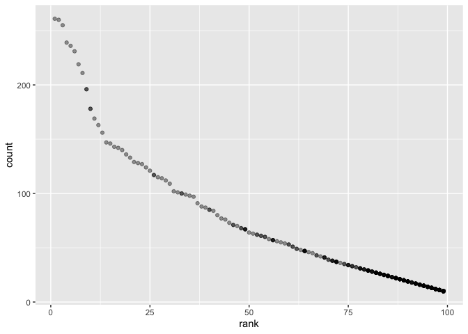

p8105\_hw2\_Ec3342
================
Ekta Chaudhary
30/09/2019

# Question 1

## Reading and cleaning the Mr. Trash Wheel sheet.

\#Mentioned the path to the xlsx file using path =
“./data/Trash\_wheet\_data.xlsx”, specified the sheet to read by
providing the name of the sheet which is Mr. Trash Wheel here. Cleaned
the variable names so that they are reasonable, omitted the rows that do
not include dumpster-specific data, rounded the number of sports balls
to the nearest integer.

``` r
trashwheel_data = 
  read_excel(path = "./data/Trash_wheet_data.xlsx", sheet = "Mr. Trash Wheel") %>%
  janitor::clean_names() %>%
  select(-x15, -x16, -x17) %>%
  drop_na(.,dumpster) %>%
  mutate(sports_balls = as.integer(sports_balls)
    )
```

    ## New names:
    ## * `` -> ...15
    ## * `` -> ...16
    ## * `` -> ...17

## Reading and cleaning the precipitation data for 2017 and 2018.

\#Omitted the rows without precipitation data and added a variable year
which is = 2017 for precipitaion\_data\_2017 and 2018 for
precipitation\_data\_2018.Combined both the precipitation data
(precipitation\_data\_2017 and precipitation\_data\_2018) to form
combined\_data. In the combined\_data used month.name to convert the
month from numeric to character variable.

``` r
precipitation_data_2017 =
  read_excel(path = "./data/Trash_wheet_data.xlsx",sheet = "2017 Precipitation", skip = 1 ) %>%
  janitor::clean_names() %>%
  drop_na() %>%
  mutate(year = 2017)

precipitation_data_2018 =
  read_excel(path = "./data/Trash_wheet_data.xlsx",sheet = "2018 Precipitation",skip = 1) %>%
  janitor::clean_names() %>%
  drop_na() %>%
  mutate(year = 2018)

combined_data = union_all(precipitation_data_2017, precipitation_data_2018) %>%
  mutate(month = month.name[month])
```

## Describing both the datasets\!

\*The trashwheel\_data comprises of 344 observations of 14 variables.

\*The precipitation\_data\_2017 comprises of 12 observations of 3
variables.

\*The precipitation\_data\_2018 comprises of 12 observations of 3
variables.

\*The number of observations in combined\_data is 24 and the number of
columns are 3.

\*The key variables are dumpster, month, year.

\*The total precipitation in 2018 was 70.33.

\*The median number of sports ball in a dumpster in 2017 was 8.

# Question 2

\#\#First read the datasets pols-month.csv and cleaned the data in
pols-month.csv. Used separate() to break up the variable mon into
integer variables year, month, and day; replaced month number with month
name and converted it to lower case to maintain consistency with rest of
the datasets. Year is converted into an integer. Removed the variable
day. Created a president variable taking values gop and dem, and removed
prez\_dem and prez\_gop; and removed the day variable.

``` r
pols_data = read_csv(file = "./data/pols-month.csv") %>%
  janitor::clean_names() %>%
  separate(col = mon, into = c("year", "month", "day")) %>% 
  select(prez_gop, prez_dem, everything()) %>%
  pivot_longer(
    prez_gop:prez_dem, names_to = "president", names_prefix = "prez_") %>%
  mutate(
   month = as.numeric(month),
   month = month.abb[month],
   month = str_to_lower(month),
   year  = as.integer(year)
  ) %>%
  select(-day)
```

    ## Parsed with column specification:
    ## cols(
    ##   mon = col_date(format = ""),
    ##   prez_gop = col_double(),
    ##   gov_gop = col_double(),
    ##   sen_gop = col_double(),
    ##   rep_gop = col_double(),
    ##   prez_dem = col_double(),
    ##   gov_dem = col_double(),
    ##   sen_dem = col_double(),
    ##   rep_dem = col_double()
    ## )

\#\#Cleaning the data in snp.csv using a similar process to the above.
Seperated the variable mon into year,month and day using
separate().Replaced month number with month name and converted it to
lower case to maintain consistency with rest of the datasets.Year is
converted into an integer. Removed the variable day. For consistency
across datasets, arranging according to year and month using the
arrange() function, and organizing so that year and month are the
leading columns using the select() function.

``` r
snp_data = read_csv(file = "./data/snp.csv") %>% 
  janitor::clean_names() %>% 
  separate(col = date, into = c("month", "day", "year")) %>% 
  arrange(as.integer(year), as.integer(month)) %>%
  select(year, month, close) %>%
  mutate(
    month = as.numeric(month),
    month = month.abb[month],
    month = str_to_lower(month),
    year = as.integer(year)
    ) 
```

    ## Parsed with column specification:
    ## cols(
    ##   date = col_character(),
    ##   close = col_double()
    ## )

\#\#Tidying the unemployment data so that it can be merged with the
previous datasets. Using pivot\_longer to go from the wide to long
format.Organizing so that year and month are the leading columns using
the select() function. Year is converted into an integer. So, in all the
three datasets month is given by name in lower case, year is an integer,
day is removed and year,month are the leading columns.

``` r
unemployment_data =
  read_csv(file = "./data/unemployment.csv") %>%
  janitor::clean_names() %>%
  pivot_longer(
    jan:dec, names_to = "month", values_to = "unemployment_rate") %>%
  select(year, month, unemployment_rate) %>%
  mutate(year = as.integer(year))
```

    ## Parsed with column specification:
    ## cols(
    ##   Year = col_double(),
    ##   Jan = col_double(),
    ##   Feb = col_double(),
    ##   Mar = col_double(),
    ##   Apr = col_double(),
    ##   May = col_double(),
    ##   Jun = col_double(),
    ##   Jul = col_double(),
    ##   Aug = col_double(),
    ##   Sep = col_double(),
    ##   Oct = col_double(),
    ##   Nov = col_double(),
    ##   Dec = col_double()
    ## )

\#\#merged\_data is formed by joining snp into pols using year and month
as keys. final\_merged\_data is formed by joining the merged\_data with
unemployment\_data using year and month as keys.

``` r
merged_data = left_join(snp_data, pols_data, by = c("year","month"))

final_merged_data = left_join(merged_data, unemployment_data, by = c("year","month"))
```

\#\#Description of the datasets

  - The dataset “pols\_data” contains 1644 observations of 10 variables
    related to the number of national politicians who are democratic or
    republican at any given time.

  - The dataset “snp\_data” contains 787 observations of 3 variables
    related to Standard & Poor’s stock market index (S\&P), often used
    as a representative measure of stock market as a whole. It has the
    date (year, month) of the observation and the closing values of the
    S\&P stock index on the associated date.

  - The dataset “unemployment\_data” contains the percentage of
    unemplyment (unemployment rate) for each month from 1948-2015. This
    dataset contains 816 observations and 3 columns.

  - The final\_merged\_data contains 1573 observations of 12 variables.
    This final\_merged\_data is formed by joining the merged\_data which
    has 1573 rows and 11 columns and the unemployment\_data which has
    816 rows and 3 columns. The merged\_data was formed by combining
    pols\_data (which has 1644 rows and 10 columns) and snp\_data which
    has 787 and 3 columns.

  - The key variables are year, month, close, president, value,
    unemployment rate.

# Question 3

\#\#Loading and tidying the data Popular\_Baby\_Names and creating a
dataset called pop\_baby. Changing the case structure of gender,
ethnicity and childs first name to lower case using mutate() function to
maintain uniformity throughout. Removing all the duplicate rows using
distinct().

``` r
pop_baby = read_csv(file = "./data/Popular_Baby_Names.csv") %>%
  janitor::clean_names() %>%
  mutate(
    gender = str_to_lower(gender), ethnicity = str_to_lower(ethnicity),
    childs_first_name = str_to_lower(childs_first_name)
    ) %>%
  distinct()
```

    ## Parsed with column specification:
    ## cols(
    ##   `Year of Birth` = col_double(),
    ##   Gender = col_character(),
    ##   Ethnicity = col_character(),
    ##   `Child's First Name` = col_character(),
    ##   Count = col_double(),
    ##   Rank = col_double()
    ## )

\#\#Producing a well-structured, reader-friendly table using kable()
function showing the rank in popularity of the name “Olivia” as a female
baby name over time; The table shows ethnicities in the rows and year in
the
columns.

``` r
olivia = filter(pop_baby, gender == "female", childs_first_name == "olivia") %>%
  select(-gender, -childs_first_name, -count)
olivia[olivia == "asian and paci"] <- "asian and pacific islander"
olivia[olivia == "black non hisp"] <- "black non hispanic"
olivia[olivia == "white non hisp"] <- "white non hispanic"
olivia = pivot_wider(olivia, names_from = "year_of_birth", values_from = "rank") 
kable(olivia, format = "html")
```

<table>

<thead>

<tr>

<th style="text-align:left;">

ethnicity

</th>

<th style="text-align:right;">

2016

</th>

<th style="text-align:right;">

2015

</th>

<th style="text-align:right;">

2014

</th>

<th style="text-align:right;">

2013

</th>

<th style="text-align:right;">

2012

</th>

<th style="text-align:right;">

2011

</th>

</tr>

</thead>

<tbody>

<tr>

<td style="text-align:left;">

asian and pacific islander

</td>

<td style="text-align:right;">

1

</td>

<td style="text-align:right;">

1

</td>

<td style="text-align:right;">

1

</td>

<td style="text-align:right;">

3

</td>

<td style="text-align:right;">

3

</td>

<td style="text-align:right;">

4

</td>

</tr>

<tr>

<td style="text-align:left;">

black non hispanic

</td>

<td style="text-align:right;">

8

</td>

<td style="text-align:right;">

4

</td>

<td style="text-align:right;">

8

</td>

<td style="text-align:right;">

6

</td>

<td style="text-align:right;">

8

</td>

<td style="text-align:right;">

10

</td>

</tr>

<tr>

<td style="text-align:left;">

hispanic

</td>

<td style="text-align:right;">

13

</td>

<td style="text-align:right;">

16

</td>

<td style="text-align:right;">

16

</td>

<td style="text-align:right;">

22

</td>

<td style="text-align:right;">

22

</td>

<td style="text-align:right;">

18

</td>

</tr>

<tr>

<td style="text-align:left;">

white non hispanic

</td>

<td style="text-align:right;">

1

</td>

<td style="text-align:right;">

1

</td>

<td style="text-align:right;">

1

</td>

<td style="text-align:right;">

1

</td>

<td style="text-align:right;">

4

</td>

<td style="text-align:right;">

2

</td>

</tr>

</tbody>

</table>

\#\#Producing a similar table called pop\_boy showing the most popular
name among male children over time for male

``` r
pop_boy = filter(pop_baby, gender == "male", rank == 1) %>%
  select(-gender, -count, -rank)
pop_boy[pop_boy == "asian and paci"] <- "asian and pacific islander"
pop_boy[pop_boy == "black non hisp"] <- "black non hispanic"
pop_boy[pop_boy == "white non hisp"] <- "white non hispanic"
pop_boy = pivot_wider(pop_boy, names_from = "year_of_birth", values_from = "childs_first_name") 
kable(pop_boy, format = "html")
```

<table>

<thead>

<tr>

<th style="text-align:left;">

ethnicity

</th>

<th style="text-align:left;">

2016

</th>

<th style="text-align:left;">

2015

</th>

<th style="text-align:left;">

2014

</th>

<th style="text-align:left;">

2013

</th>

<th style="text-align:left;">

2012

</th>

<th style="text-align:left;">

2011

</th>

</tr>

</thead>

<tbody>

<tr>

<td style="text-align:left;">

asian and pacific islander

</td>

<td style="text-align:left;">

ethan

</td>

<td style="text-align:left;">

jayden

</td>

<td style="text-align:left;">

jayden

</td>

<td style="text-align:left;">

jayden

</td>

<td style="text-align:left;">

ryan

</td>

<td style="text-align:left;">

ethan

</td>

</tr>

<tr>

<td style="text-align:left;">

black non hispanic

</td>

<td style="text-align:left;">

noah

</td>

<td style="text-align:left;">

noah

</td>

<td style="text-align:left;">

ethan

</td>

<td style="text-align:left;">

ethan

</td>

<td style="text-align:left;">

jayden

</td>

<td style="text-align:left;">

jayden

</td>

</tr>

<tr>

<td style="text-align:left;">

hispanic

</td>

<td style="text-align:left;">

liam

</td>

<td style="text-align:left;">

liam

</td>

<td style="text-align:left;">

liam

</td>

<td style="text-align:left;">

jayden

</td>

<td style="text-align:left;">

jayden

</td>

<td style="text-align:left;">

jayden

</td>

</tr>

<tr>

<td style="text-align:left;">

white non hispanic

</td>

<td style="text-align:left;">

joseph

</td>

<td style="text-align:left;">

david

</td>

<td style="text-align:left;">

joseph

</td>

<td style="text-align:left;">

david

</td>

<td style="text-align:left;">

joseph

</td>

<td style="text-align:left;">

michael

</td>

</tr>

</tbody>

</table>

\#\#Producing a scatter plot showing the number of children with a name
(y axis) against the rank in popularity of that name (x axis) for male,
white non-hispanic children born in
2016.

``` r
filter(pop_baby, gender == "male", ethnicity == "white non hispanic", year_of_birth == 2016) %>%
  ggplot(aes(x = rank,y = count)) + geom_point()
```

<!-- -->
